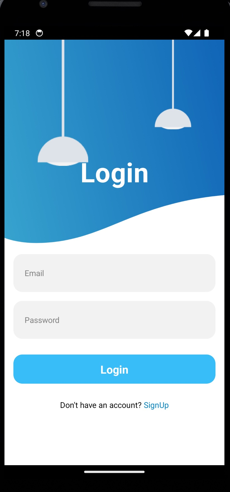
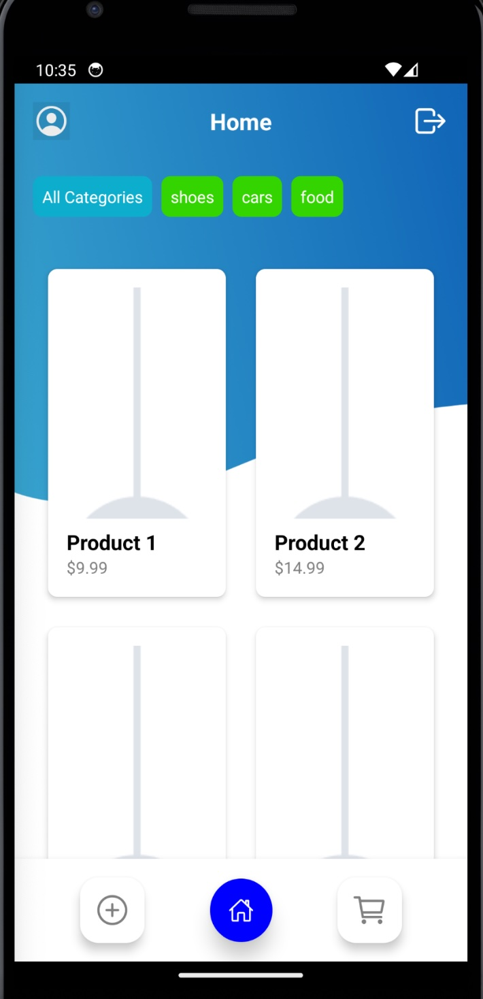
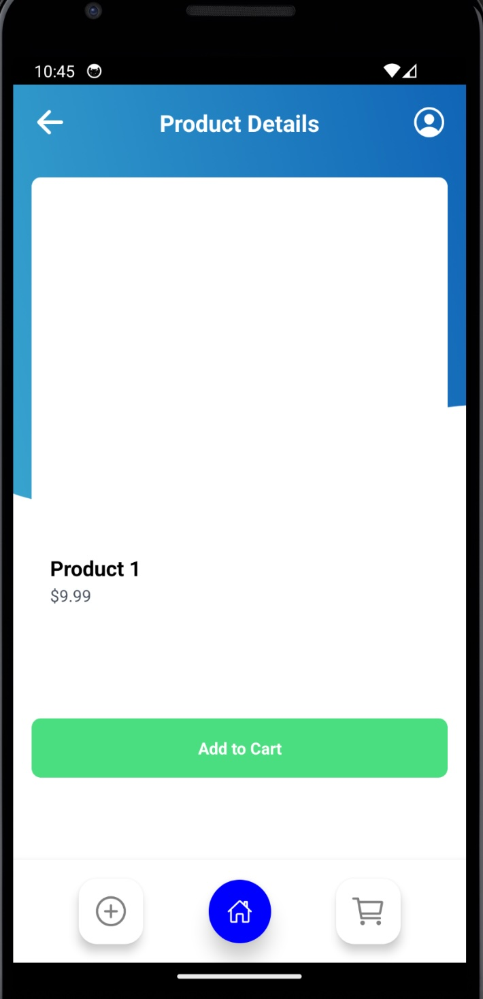
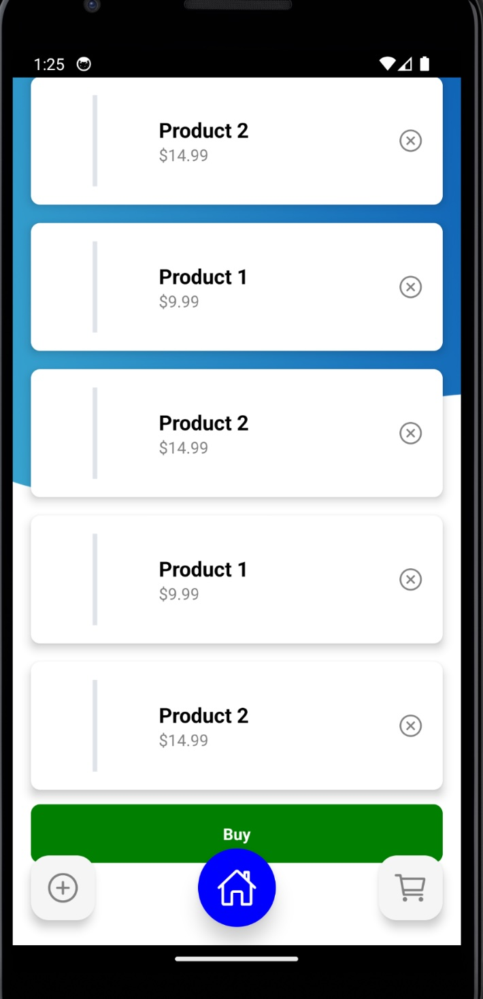

# BonnOccasion
A cross- platform mobile application for buying and selling second-hand products. Developed with Spring Boot for the backend using REST APIs, React Native for the frontend, and Firebase.
## This is the client-side implementation of the application.
## Screenshots of the application's screens ✨:

